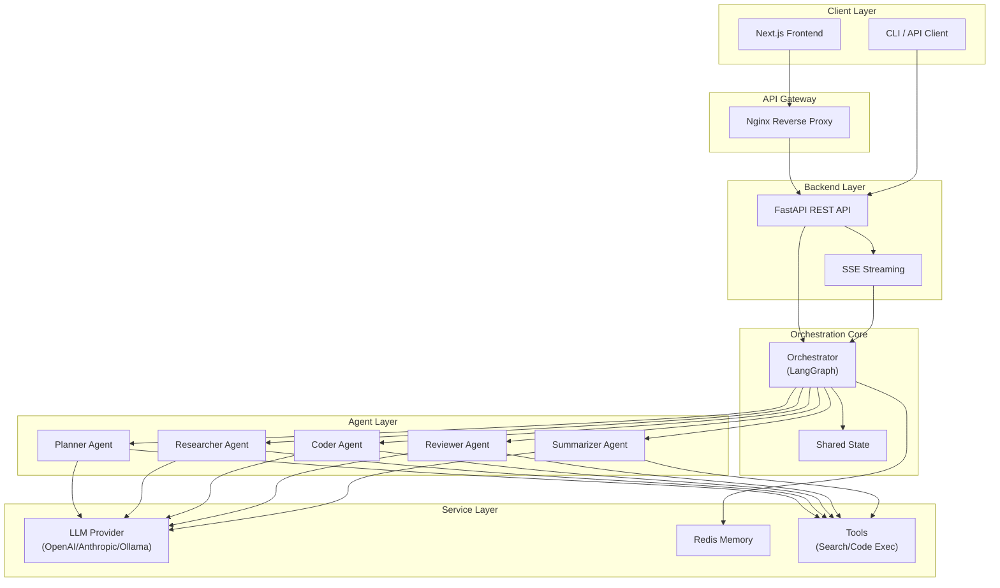
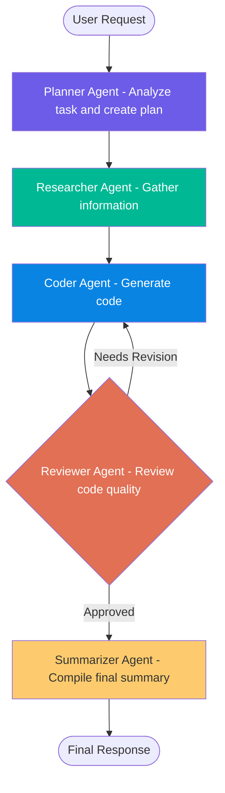

<div align="center">

```
    ╔══════════════════════════════════════════════════════════════╗
    ║                                                              ║
    ║     ██████╗ ██████╗ ██████╗ ███████╗   ██████╗ ██████╗      ║
    ║    ██╔════╝██╔═══██╗██╔══██╗██╔════╝   ██╔══██╗██╔══██╗     ║
    ║    ██║     ██║   ██║██████╔╝█████╗     ██████╔╝██████╔╝     ║
    ║    ██║     ██║   ██║██╔══██╗██╔══╝     ██╔═══╝ ██╔═══╝      ║
    ║    ╚██████╗╚██████╔╝██║  ██║███████╗   ██║     ██║          ║
    ║     ╚═════╝ ╚═════╝ ╚═╝  ╚═╝╚══════╝   ╚═╝     ╚═╝          ║
    ║                                                              ║
    ║          Multi-Agent Orchestration System                     ║
    ║                                                              ║
    ╚══════════════════════════════════════════════════════════════╝
```

# AgentOrchestra

**An open-source multi-agent collaboration system that orchestrates specialized AI agents to tackle complex tasks.**

[](https://python.org)
[](https://fastapi.tiangolo.com)
[](https://langchain-ai.github.io/langgraph/)
[](https://nextjs.org)
[](LICENSE)
[](https://docker.com)
[](CONTRIBUTING.md)
[](https://docs.astral.sh/ruff/)

[Features](#-features) | [Architecture](#-architecture) | [Quick Start](#-quick-start) | [API Docs](#-api-documentation) | [Contributing](#contributing)

</div>

---

## Overview

AgentOrchestra is a production-ready multi-agent orchestration framework that coordinates specialized AI agents through a structured workflow powered by LangGraph. Each agent has a distinct role -- planning, researching, coding, reviewing, and summarizing -- working together like a well-organized team to deliver high-quality results for complex tasks.

Built with **FastAPI** on the backend and **Next.js** on the frontend, AgentOrchestra provides a complete, deployable solution with support for multiple LLM providers including **OpenAI**, **Anthropic**, and **Ollama** (local models).

---

## Features

### Core Capabilities

- **Multi-Agent Orchestration** -- Coordinate 5 specialized agents (Planner, Researcher, Coder, Reviewer, Summarizer) through a LangGraph-powered workflow
- **Intelligent Review Loop** -- Automatic code revision cycle with configurable maximum iterations
- **Real-time Streaming** -- Server-Sent Events (SSE) for live agent progress updates
- **Multi-Model Support** -- Unified adapter for OpenAI (GPT-4o), Anthropic (Claude), and Ollama (local LLMs)
- **Dynamic Agent Configuration** -- Update agent parameters (model, temperature, system prompt) at runtime via API

### Developer Experience

- **Type-Safe** -- Full type annotations with Pydantic models and mypy validation
- **Auto-Generated API Docs** -- Interactive Swagger UI and ReDoc at `/docs` and `/redoc`
- **Docker-Ready** -- Production-grade Docker Compose with Nginx reverse proxy, Redis, and health checks
- **Developer Tooling** -- Ruff linting/formatting, pre-commit hooks, pytest with coverage
- **Makefile Commands** -- One-command setup, testing, linting, and deployment

### Architecture

- **Modular Design** -- Clean separation between agents, services, API, and configuration
- **Adapter Pattern** -- Pluggable LLM provider adapters with factory-based creation
- **State Management** -- Centralized workflow state flowing through all agents
- **Extensible** -- Easy to add custom agents, tools, and LLM providers

---

## Architecture

### System Architecture



### Agent Workflow



---

## Quick Start

### Prerequisites

- **Python 3.11+** (backend)
- **Node.js 18+** with pnpm (frontend)
- **Docker & Docker Compose** (optional, for containerized deployment)
- **An LLM API key** -- OpenAI, Anthropic, or Ollama running locally

### Option 1: Local Development

```bash
# 1. Clone the repository
git clone https://github.com/your-org/AgentOrchestra.git
cd AgentOrchestra

# 2. Install dependencies
make setup

# 3. Configure environment
cp backend/.env.example backend/.env
# Edit backend/.env with your API keys:
#   OPENAI_API_KEY=sk-...
#   ANTHROPIC_API_KEY=sk-ant-...
#   Or set OLLAMA_BASE_URL for local models

# 4. Start backend (terminal 1)
make dev-backend

# 5. Start frontend (terminal 2)
make dev-frontend
```

The application will be available at:
- **Frontend:** http://localhost:3000
- **Backend API:** http://localhost:8000
- **API Docs:** http://localhost:8000/docs
- **ReDoc:** http://localhost:8000/redoc

### Option 2: Docker Compose (Recommended)

```bash
# 1. Clone and configure
git clone https://github.com/your-org/AgentOrchestra.git
cd AgentOrchestra
cp backend/.env.example backend/.env
# Edit backend/.env with your API keys

# 2. Start all services
docker compose up -d

# 3. Check status
docker compose ps
docker compose logs -f
```

The application will be available at http://localhost (proxied through Nginx).

### Option 3: Development with Docker Compose

```bash
# Start development environment with hot-reload
make dev
```

### Verify Installation

```bash
# Health check
curl http://localhost:8000/health

# Expected response:
# {"status":"healthy","app":"AgentOrchestra","version":"0.1.0"}
```

---

## Tech Stack

| Layer | Technology | Purpose |
|-------|-----------|---------|
| **Frontend** |  | React-based UI with App Router |
| |  | Type-safe frontend code |
| |  | Utility-first CSS framework |
| |  | Lightweight state management |
| **Backend** |  | High-performance async web framework |
| |  | Agent workflow orchestration |
| |  | LLM abstraction layer |
| |  | Data validation & settings |
| **Infrastructure** |  | Caching & conversation memory |
| |  | Reverse proxy & load balancing |
| |  | Containerization |
| **LLM Providers** |  | GPT-4o, GPT-4, GPT-3.5 |
| |  | Claude Sonnet, Claude Opus |
| |  | Llama 3, Mistral, and more |
| **Quality** |  | Python linting & formatting |
| |  | Static type checking |
| |  | Testing framework |
| |  | Git hooks |

---

## Project Structure

```
AgentOrchestra/
├── .github/                          # GitHub configuration
│   ├── ISSUE_TEMPLATE/               # Issue templates (bug, feature)
│   ├── workflows/                    # CI/CD workflows
│   │   ├── ci.yml                    # Continuous integration
│   │   ├── docker.yml                # Docker build & push
│   │   └── release.yml               # Release automation
│   └── PULL_REQUEST_TEMPLATE.md      # PR template
├── backend/                          # Python backend
│   ├── app/
│   │   ├── agents/                   # Agent implementations
│   │   │   ├── base.py               # Abstract base agent class
│   │   │   ├── planner/              # Planner agent
│   │   │   ├── researcher/           # Researcher agent
│   │   │   ├── coder/                # Coder agent
│   │   │   ├── reviewer/             # Reviewer agent
│   │   │   └── summarizer/           # Summarizer agent
│   │   ├── api/v1/endpoints/         # REST API endpoints
│   │   │   ├── chat.py               # Chat & streaming
│   │   │   ├── agents.py             # Agent management
│   │   │   └── tasks.py              # Task management
│   │   ├── core/
│   │   │   └── orchestrator.py       # LangGraph orchestration engine
│   │   ├── models/
│   │   │   └── llm_models.py         # LLM adapter pattern
│   │   ├── schemas/                  # Pydantic data models
│   │   ├── services/                 # Business logic services
│   │   │   ├── llm/                  # LLM provider service
│   │   │   ├── memory/               # Conversation memory (Redis)
│   │   │   └── tools/                # Agent tools (search, code exec)
│   │   ├── config/
│   │   │   └── settings.py           # Application settings
│   │   ├── utils/
│   │   │   └── logger.py             # Logging utilities
│   │   └── main.py                   # FastAPI application entry
│   ├── tests/                        # Test suite
│   │   ├── unit/                     # Unit tests
│   │   └── conftest.py               # Test fixtures
│   ├── pyproject.toml                # Python project config
│   └── .env.example                  # Environment template
├── frontend/                         # Next.js frontend
│   ├── src/
│   │   ├── app/                      # Next.js App Router pages
│   │   ├── components/               # React components
│   │   │   ├── agent/                # Agent-related components
│   │   │   ├── chat/                 # Chat UI components
│   │   │   ├── layout/               # Layout components
│   │   │   └── ui/                   # Shared UI components
│   │   ├── hooks/                    # Custom React hooks
│   │   ├── services/                 # API service layer
│   │   ├── store/                    # Zustand state stores
│   │   ├── types/                    # TypeScript type definitions
│   │   └── lib/                      # Utility functions
│   ├── package.json                  # Node.js dependencies
│   └── tailwind.config.ts            # Tailwind CSS config
├── docker/                           # Docker configurations
│   ├── backend/Dockerfile            # Backend image
│   ├── frontend/Dockerfile           # Frontend image
│   └── nginx/nginx.conf              # Nginx config
├── docker-compose.yml                # Production compose
├── docker-compose.dev.yml            # Development compose
├── Makefile                          # Development commands
├── .editorconfig                     # Editor configuration
├── .gitignore                        # Git ignore rules
├── .pre-commit-config.yaml           # Pre-commit hooks
├── LICENSE                           # MIT License
├── README.md                         # This file
├── CONTRIBUTING.md                   # Contribution guide
├── CHANGELOG.md                      # Version changelog
└── docs/                             # Documentation
    ├── architecture/
    │   ├── overview.md               # Architecture overview
    │   └── agents.md                 # Agent system design
    ├── api/
    │   ├── README.md                 # API documentation
    │   └── endpoints.md              # API endpoint reference
    └── roadmap.md                    # Project roadmap
```

---

## API Documentation

AgentOrchestra provides a comprehensive REST API with auto-generated interactive documentation.

| Resource | Base URL | Description |
|----------|----------|-------------|
| **Swagger UI** | `http://localhost:8000/docs` | Interactive API explorer |
| **ReDoc** | `http://localhost:8000/redoc` | Alternative API documentation |
| **Health Check** | `GET /health` | Service health status |

### Quick API Examples

```bash
# Send a chat message
curl -X POST http://localhost:8000/api/v1/chat \
  -H "Content-Type: application/json" \
  -d '{"message": "Build a REST API for a todo app"}'

# Stream a response via SSE
curl http://localhost:8000/api/v1/chat/stream?message="Hello"

# List all agents
curl http://localhost:8000/api/v1/agents

# Create a task
curl -X POST http://localhost:8000/api/v1/tasks \
  -H "Content-Type: application/json" \
  -d '{"message": "Analyze the market trends", "priority": "high"}'
```

For the complete API reference, see [docs/api/README.md](docs/api/README.md) and [docs/api/endpoints.md](docs/api/endpoints.md).

---

## Configuration

AgentOrchestra is configured via environment variables. Copy `.env.example` to `.env` and customize:

```bash
# --- Application ---
APP_NAME=AgentOrchestra
DEBUG=true
LOG_LEVEL=INFO

# --- LLM Provider (choose one or more) ---
DEFAULT_LLM_PROVIDER=openai

# OpenAI
OPENAI_API_KEY=sk-your-key-here
OPENAI_MODEL=gpt-4o
OPENAI_TEMPERATURE=0.7

# Anthropic
ANTHROPIC_API_KEY=sk-ant-your-key-here
ANTHROPIC_MODEL=claude-sonnet-4-20250514

# Ollama (local models, no API key needed)
OLLAMA_BASE_URL=http://localhost:11434
OLLAMA_MODEL=llama3

# --- Redis ---
REDIS_URL=redis://localhost:6379/0

# --- Orchestration ---
MAX_REVISION_ROUNDS=3
```

---

## Development

```bash
# Install all dependencies
make install

# Run tests
make test

# Run linter
make lint

# Format code
make format

# Type checking
make typecheck

# Run all quality checks
make check
```

See [CONTRIBUTING.md](CONTRIBUTING.md) for detailed contribution guidelines.

---

## Documentation

| Document | Description |
|----------|-------------|
| [Architecture Overview](docs/architecture/overview.md) | System design, data flow, and technology choices |
| [Agent System Design](docs/architecture/agents.md) | Agent roles, communication, and custom agent development |
| [API Documentation](docs/api/README.md) | Authentication, request formats, and error handling |
| [API Endpoints](docs/api/endpoints.md) | Complete endpoint reference with examples |
| [Roadmap](docs/roadmap.md) | Development roadmap and future plans |
| [Contributing Guide](CONTRIBUTING.md) | How to contribute to the project |
| [Changelog](CHANGELOG.md) | Version history and changes |

---

## Contributing

Contributions are welcome! Please read our [Contributing Guide](CONTRIBUTING.md) for details on:

- Setting up the development environment
- Code style and conventions
- Pull request process
- Commit message format (Conventional Commits)
- Issue reporting guidelines

---

## License

This project is licensed under the MIT License. See the [LICENSE](LICENSE) file for details.

---

## Acknowledgments

- [LangGraph](https://github.com/langchain-ai/langgraph) -- Powerful framework for building stateful, multi-actor applications with LLMs
- [LangChain](https://github.com/langchain-ai/langchain) -- Framework for developing applications powered by language models
- [FastAPI](https://github.com/tiangolo/fastapi) -- Modern, fast web framework for building APIs with Python
- [Next.js](https://nextjs.org/) -- The React framework for production
- [Anthropic](https://anthropic.com) -- For Claude, a helpful and harmless AI assistant
- [OpenAI](https://openai.com) -- For GPT-4o and other powerful language models
- [Ollama](https://ollama.ai) -- For running local LLMs with ease

---

## Star History

If you find AgentOrchestra useful, please consider giving it a star! It helps the project grow and reach more developers.

<div align="center">

**Built with care by the AgentOrchestra Contributors**

</div>
