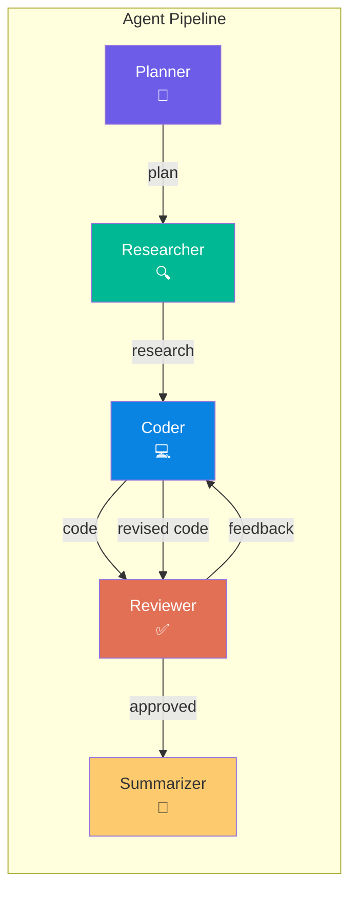
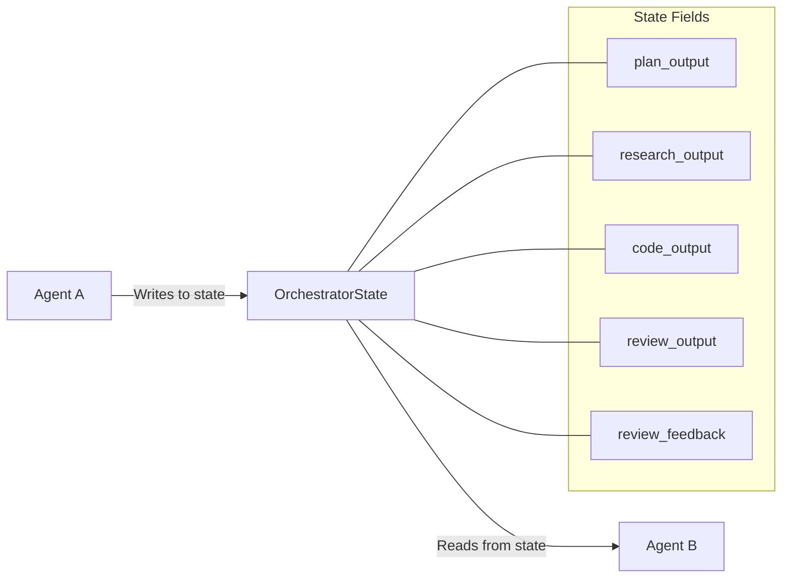
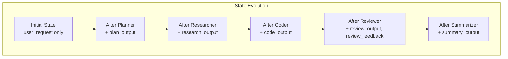
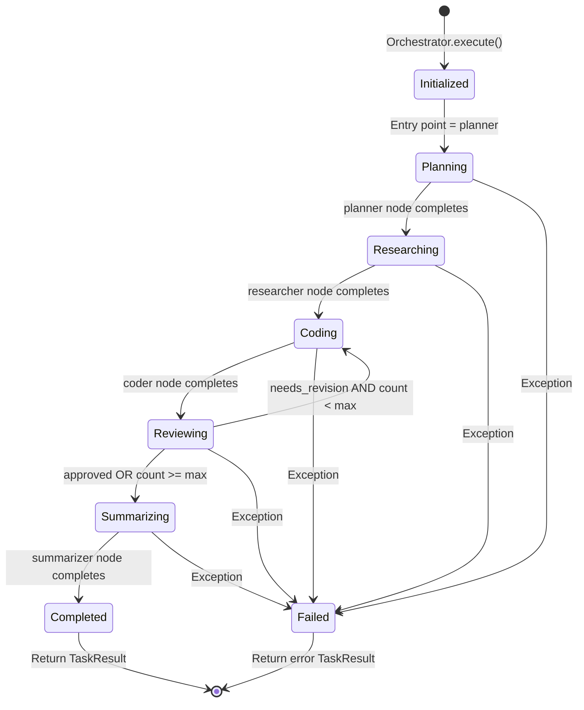
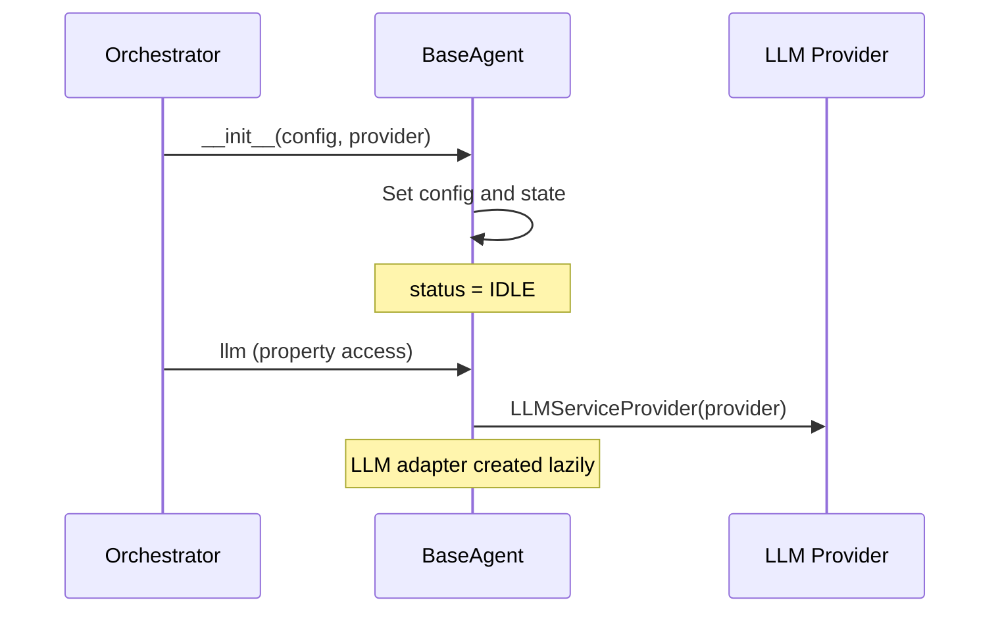
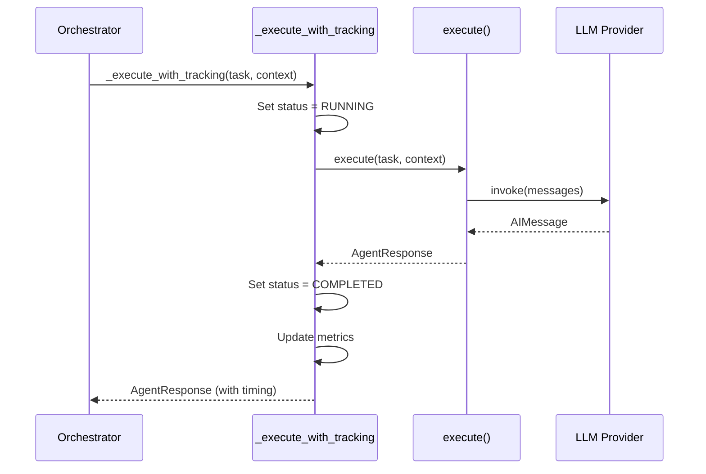

# Agent System Design

This document describes the agent system architecture in AgentOrchestra, including agent design principles, individual agent responsibilities, communication mechanisms, state management, and how to build custom agents.

---

## Table of Contents

- [Design Principles](#design-principles)
- [Agent Overview](#agent-overview)
- [Agent Roles](#agent-roles)
- [Communication Mechanism](#communication-mechanism)
- [State Management](#state-management)
- [Agent Lifecycle](#agent-lifecycle)
- [Custom Agent Development Guide](#custom-agent-development-guide)
- [Agent Configuration](#agent-configuration)
- [Best Practices](#best-practices)

---

## Design Principles

### 1. Single Responsibility

Each agent has one clear, well-defined responsibility. The Planner plans, the Researcher researches, the Coder codes, the Reviewer reviews, and the Summarizer summarizes. This separation makes agents easier to test, debug, and maintain.

### 2. Context Propagation

Agents do not work in isolation. Each agent receives the outputs of previous agents as context, enabling informed decision-making. The Planner's output informs the Researcher, whose findings guide the Coder, and so on.

### 3. Graceful Degradation

If an agent fails, the system logs the error and continues with available data. The Summarizer can still produce a useful output even if some intermediate steps produced errors.

### 4. Configurable Autonomy

Each agent can be configured independently -- model, temperature, system prompt, tools, timeout, and retry count. This allows fine-tuning agent behavior for different use cases without code changes.

### 5. Observable Execution

Every agent execution is tracked with timing, status, and error information. This metadata flows through the system and is available in API responses, enabling monitoring and debugging.

---

## Agent Overview



| Agent | Type | Input | Output | Key Capability |
|-------|------|-------|--------|---------------|
| **Planner** | `PLANNER` | User request | Execution plan | Task decomposition, strategy formulation |
| **Researcher** | `RESEARCHER` | User request + plan | Research findings | Information gathering, context building |
| **Coder** | `RESEARCHER` | User request + plan + research + feedback | Code artifacts | Code generation, solution implementation |
| **Reviewer** | `REVIEWER` | Code + original task | Review + feedback | Quality assessment, improvement suggestions |
| **Summarizer** | `SUMMARIZER` | All agent outputs | Final summary | Synthesis, clear communication |

---

## Agent Roles

### Planner Agent

**Role:** Analyzes the user's request and creates a structured execution plan.

**Responsibilities:**
- Break down complex tasks into manageable steps
- Identify dependencies between steps
- Determine the order of execution
- Estimate complexity and required resources
- Define success criteria

**System Prompt Strategy:**
The Planner uses a system prompt that instructs it to think step-by-step, identify potential challenges, and create a clear, actionable plan.

**Output Format:**
```
## Task Analysis
[Analysis of the user's request]

## Execution Plan
1. [Step 1 description]
2. [Step 2 description]
3. [Step 3 description]

## Key Considerations
- [Consideration 1]
- [Consideration 2]

## Estimated Complexity
[Low/Medium/High with reasoning]
```

**Context Received:**
- `user_request`: The original user input

**Context Provided To:**
- Researcher (via `plan_output` in state)

---

### Researcher Agent

**Role:** Gathers relevant information, context, and reference material needed for the task.

**Responsibilities:**
- Identify what information is needed
- Search for relevant documentation, examples, and best practices
- Synthesize findings into a coherent research summary
- Highlight key insights and potential pitfalls
- Provide references and sources

**System Prompt Strategy:**
The Researcher uses a system prompt that emphasizes accuracy, source credibility, and comprehensive coverage of the topic.

**Output Format:**
```
## Research Summary
[High-level summary of findings]

## Key Findings
1. [Finding 1 with details]
2. [Finding 2 with details]

## Technical Context
[Relevant technical details and constraints]

## Recommendations
[Based on research, what approach to take]

## References
- [Source 1]
- [Source 2]
```

**Context Received:**
- `user_request`: The original user input
- `plan`: The Planner's execution plan

**Context Provided To:**
- Coder (via `research_output` in state)

---

### Coder Agent

**Role:** Generates code, technical solutions, and implementation artifacts based on the plan and research.

**Responsibilities:**
- Write clean, well-structured code
- Follow best practices and design patterns
- Include appropriate error handling
- Add comments and documentation
- Produce complete, runnable solutions

**System Prompt Strategy:**
The Coder uses a system prompt that emphasizes code quality, readability, maintainability, and adherence to the plan and research findings.

**Output Format:**
```
## Implementation
[Description of the approach]

## Code
```language
// Well-commented, production-quality code
```

## Explanation
[Explanation of key decisions and patterns used]

## Usage
[How to use/run the generated code]
```

**Context Received:**
- `user_request`: The original user input
- `plan`: The Planner's execution plan
- `research`: The Researcher's findings
- `review_feedback`: (On revision) The Reviewer's feedback

**Context Provided To:**
- Reviewer (via `code_output` in state)

**Special Behavior:**
The Coder can be invoked multiple times if the Reviewer identifies issues. On each revision, it receives the previous review feedback and produces an improved version.

---

### Reviewer Agent

**Role:** Evaluates the quality of generated code and provides actionable feedback.

**Responsibilities:**
- Assess code correctness and completeness
- Check for bugs, security issues, and edge cases
- Evaluate adherence to the original requirements
- Verify code style and best practices
- Decide whether the code is acceptable or needs revision

**System Prompt Strategy:**
The Reviewer uses a system prompt that instructs it to be thorough but fair, focusing on substantive issues rather than stylistic preferences.

**Output Format:**
```
## Review Summary
[Overall assessment: Approved / Needs Revision]

## Strengths
- [What was done well]

## Issues Found
1. [Issue 1 with severity and suggested fix]
2. [Issue 2 with severity and suggested fix]

## Suggestions
- [Optional improvement suggestions]

## Decision
[APPROVED / NEEDS_REVISION with reasoning]
```

**Context Received:**
- `code`: The Coder's generated code
- `original_task`: The user's original request

**Routing Decision:**
The Reviewer's output determines the next step in the workflow:

```mermaid
flowchart TD
    Reviewer{Reviewer Decision}
    Reviewer --|"Needs Revision<br/>AND revision_count < max"| Coder["Coder (Revision)"]
    Reviewer --|"Approved<br/>OR revision_count >= max"| Summarizer
```

- If revision is needed and the revision count is below the maximum, the workflow routes back to the Coder
- If approved (or max revisions reached), the workflow proceeds to the Summarizer

---

### Summarizer Agent

**Role:** Compiles all agent outputs into a coherent, user-friendly final response.

**Responsibilities:**
- Synthesize outputs from all agents into a unified summary
- Present the information in a clear, structured format
- Highlight key results and deliverables
- Note any caveats or limitations
- Provide actionable next steps

**System Prompt Strategy:**
The Summarizer uses a system prompt that emphasizes clarity, completeness, and user-centric communication.

**Output Format:**
```
## Summary
[Concise overview of what was accomplished]

## Key Results
1. [Result 1]
2. [Result 2]

## Deliverables
- [Deliverable 1 with description]
- [Deliverable 2 with description]

## Notes
[Any caveats, limitations, or important context]

## Next Steps
[Recommended follow-up actions]
```

**Context Received:**
- `user_request`: The original user input
- `plan_output`: The Planner's plan
- `research_output`: The Researcher's findings
- `code_output`: The Coder's final code
- `review_output`: The Reviewer's assessment
- `revision_count`: Number of revision rounds

**This is the final agent** -- its output becomes the response returned to the user.

---

## Communication Mechanism

### Indirect Communication via Shared State

Agents do not communicate directly with each other. Instead, they communicate indirectly through the shared `OrchestratorState` object managed by the LangGraph workflow.



**How it works:**

1. The Orchestrator initializes the `OrchestratorState` with the user's request
2. Each agent node function receives the current state as input
3. The agent reads relevant fields from the state (outputs of previous agents)
4. The agent performs its task (typically calling an LLM)
5. The agent returns a dictionary of state fields to update
6. LangGraph merges the updates into the state
7. The next agent node receives the updated state

### Context Flow



### Why Indirect Communication?

- **Decoupling** -- Agents don't need to know about each other
- **Testability** -- Each agent can be tested in isolation with mock state
- **Observability** -- All data flows through a single, inspectable state object
- **Flexibility** -- The workflow can be modified without changing agent implementations
- **Retry safety** -- Failed agents can be retried with the same state

---

## State Management

### OrchestratorState

The `OrchestratorState` is a TypedDict that defines the complete state schema:

```python
class OrchestratorState(TypedDict, total=False):
    user_request: str          # The original user request
    plan_output: str           # Planner's output
    research_output: str       # Researcher's output
    code_output: str           # Coder's output
    review_output: str         # Reviewer's output
    summary_output: str        # Summarizer's output
    review_feedback: str       # Reviewer's revision feedback
    revision_count: int        # Current revision iteration
    max_revisions: int         # Maximum allowed revisions
    agent_responses: list      # All agent responses for tracking
    error: str | None          # Error message if workflow failed
    current_agent: str         # Currently executing agent name
```

### State Lifecycle



### Agent Response Tracking

Every agent execution produces an `AgentResponse` object that is appended to the `agent_responses` list:

```python
class AgentResponse(BaseModel):
    agent_name: str              # e.g., "planner"
    agent_type: AgentType        # e.g., AgentType.PLANNER
    success: bool                # Whether execution succeeded
    content: str                 # Primary output content
    artifacts: list[dict]        # Additional artifacts (code, files)
    metadata: dict               # Execution metadata
    execution_time_ms: float     # Time taken
    error: str | None            # Error message if failed
```

This tracking enables:
- Full audit trail of agent executions
- Per-agent timing and performance analysis
- Debugging with complete execution history
- Client-side display of agent progress

---

## Agent Lifecycle

### Initialization



### Execution



### Error Handling

If an agent's `execute()` method raises an exception:

1. The exception is caught by `_execute_with_tracking`
2. The agent status is set to `ERROR`
3. The error message is recorded in the agent state
4. An `AgentResponse` with `success=False` and the error message is returned
5. The orchestrator logs the error but does not crash
6. The workflow continues with the next agent (graceful degradation)

---

## Custom Agent Development Guide

### Step 1: Create the Agent Module

Create a new directory under `backend/app/agents/`:

```
backend/app/agents/
├── my_agent/
│   ├── __init__.py
│   └── agent.py
```

### Step 2: Implement the Agent

```python
"""Custom agent implementation for AgentOrchestra."""

from __future__ import annotations

import logging
from typing import Any

from app.agents.base import BaseAgent
from app.schemas.agent import AgentConfig, AgentResponse, AgentType

logger = logging.getLogger(__name__)


class MyCustomAgent(BaseAgent):
    """A custom agent that performs specialized analysis.

    This agent demonstrates how to create a new agent type
    for the AgentOrchestra system.

    Attributes:
        name: Unique agent identifier.
        description: Human-readable description.
    """

    @property
    def name(self) -> str:
        """Return the agent's unique name."""
        return "my_custom_agent"

    @property
    def description(self) -> str:
        """Return a description of the agent's capabilities."""
        return "Performs specialized data analysis and insight extraction"

    @property
    def role(self) -> str:
        """Return the agent's role in the workflow."""
        return "Analyzes data and extracts actionable insights"

    @property
    def agent_type(self) -> AgentType:
        """Return the agent's type classification."""
        return AgentType.RESEARCHER  # Or define a new type

    @property
    def system_prompt(self) -> str:
        """Return the system prompt for this agent."""
        return (
            "You are a specialized data analysis agent. "
            "Your role is to analyze the provided data and context, "
            "extract key insights, and present findings in a clear format.\n\n"
            "Guidelines:\n"
            "- Focus on actionable insights\n"
            "- Support claims with evidence from the data\n"
            "- Identify patterns and anomalies\n"
            "- Provide clear recommendations\n"
        )

    def _default_config(self) -> AgentConfig:
        """Return default configuration for this agent."""
        return AgentConfig(
            name=self.name,
            agent_type=self.agent_type,
            description=self.description,
            temperature=0.3,  # Lower temperature for analytical tasks
            max_tokens=4096,
            max_retries=3,
            timeout_seconds=120,
        )

    async def execute(
        self,
        task: str,
        context: dict[str, Any],
    ) -> AgentResponse:
        """Execute the agent's analysis task.

        Args:
            task: The analysis task description.
            context: Additional context including previous agent outputs.

        Returns:
            AgentResponse: The analysis results.
        """
        # Build the prompt with context
        plan = context.get("plan", "No plan available")
        research = context.get("research", "No research available")

        prompt = (
            f"## Task\n{task}\n\n"
            f"## Plan\n{plan}\n\n"
            f"## Research Context\n{research}\n\n"
            f"## Instructions\n"
            f"Analyze the above information and provide:\n"
            f"1. Key findings\n"
            f"2. Data-driven insights\n"
            f"3. Recommendations\n"
        )

        # Call the LLM
        from langchain_core.messages import HumanMessage, SystemMessage

        messages = [
            SystemMessage(content=self.system_prompt),
            HumanMessage(content=prompt),
        ]

        response = await self.llm.invoke(messages)

        return AgentResponse(
            agent_name=self.name,
            agent_type=self.agent_type,
            success=True,
            content=response.content,
            metadata={
                "model": self.llm.model_name,
                "provider": self.llm.provider_name,
            },
        )
```

### Step 3: Register in the Orchestrator

To integrate your custom agent into the workflow, modify the `Orchestrator` class:

```python
# In app/core/orchestrator.py

from app.agents.my_agent.agent import MyCustomAgent

class Orchestrator:
    def __init__(self, provider: str | None = None) -> None:
        # ... existing agents ...
        self.my_agent = MyCustomAgent(provider=provider)

        # Add to the workflow graph
        workflow.add_node("my_agent", self._my_agent_node)
        # Add edges as needed
```

### Step 4: Add Tests

```python
# In tests/unit/test_agents.py

import pytest
from app.agents.my_agent.agent import MyCustomAgent


@pytest.fixture
def agent():
    return MyCustomAgent()


def test_agent_properties(agent):
    assert agent.name == "my_custom_agent"
    assert agent.agent_type.value == "researcher"
    assert len(agent.description) > 0


@pytest.mark.asyncio
async def test_agent_execute(agent, mock_llm):
    result = await agent.execute(
        task="Analyze the data",
        context={"plan": "Some plan", "research": "Some research"},
    )
    assert result.success is True
    assert len(result.content) > 0
```

---

## Agent Configuration

### Runtime Configuration

Agents can be configured at runtime via the API:

```bash
curl -X POST http://localhost:8000/api/v1/agents/coder/config \
  -H "Content-Type: application/json" \
  -d '{
    "model": "gpt-4o",
    "temperature": 0.5,
    "max_tokens": 8192,
    "system_prompt": "You are an expert Python developer..."
  }'
```

### Configuration Fields

| Field | Type | Default | Description |
|-------|------|---------|-------------|
| `model` | `str` | Provider default | LLM model to use |
| `temperature` | `float` | 0.7 | Sampling temperature (0.0 - 2.0) |
| `max_tokens` | `int` | 4096 | Maximum tokens per response |
| `system_prompt` | `str` | Agent default | Custom system prompt |
| `tools` | `list[str]` | `[]` | Available tool names |
| `max_retries` | `int` | 3 | Maximum retry attempts |
| `timeout_seconds` | `int` | 120 | Execution timeout |

### Per-Provider Configuration

Each LLM provider can be configured independently via environment variables:

```bash
# OpenAI
OPENAI_API_KEY=sk-...
OPENAI_MODEL=gpt-4o
OPENAI_TEMPERATURE=0.7
OPENAI_MAX_TOKENS=4096

# Anthropic
ANTHROPIC_API_KEY=sk-ant-...
ANTHROPIC_MODEL=claude-sonnet-4-20250514
ANTHROPIC_TEMPERATURE=0.7

# Ollama (local)
OLLAMA_BASE_URL=http://localhost:11434
OLLAMA_MODEL=llama3
OLLAMA_TEMPERATURE=0.7
```

---

## Best Practices

### Writing Effective System Prompts

1. **Be specific** -- Clearly define the agent's role, constraints, and output format
2. **Use examples** -- Include few-shot examples when possible
3. **Set boundaries** -- Explicitly state what the agent should and should not do
4. **Structure output** -- Specify the desired output format (Markdown, JSON, etc.)
5. **Keep it focused** -- Avoid overly long prompts that dilute the agent's focus

### Optimizing Agent Performance

1. **Choose the right model** -- Use smaller/faster models for simple tasks, larger models for complex reasoning
2. **Set appropriate temperature** -- Lower temperature (0.1-0.3) for analytical tasks, higher (0.7-1.0) for creative tasks
3. **Limit context** -- Only pass relevant context to avoid token waste
4. **Use streaming** -- For long-running tasks, use SSE streaming to provide real-time feedback
5. **Monitor token usage** -- Track token consumption to optimize costs

### Testing Agents

1. **Unit test with mocks** -- Mock the LLM provider to test agent logic in isolation
2. **Integration test with real LLM** -- Test end-to-end with a real (or local) LLM
3. **Test error scenarios** -- Verify agents handle errors gracefully
4. **Test with varied inputs** -- Cover edge cases, long inputs, and ambiguous requests
5. **Benchmark performance** -- Measure response time and token usage
