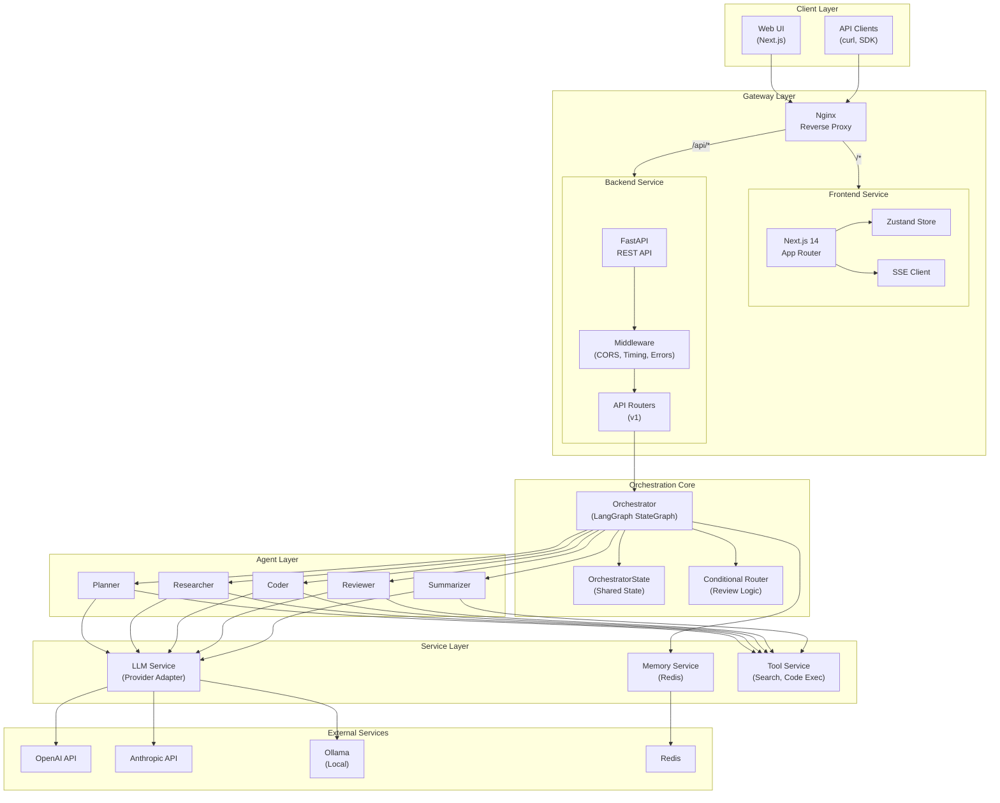
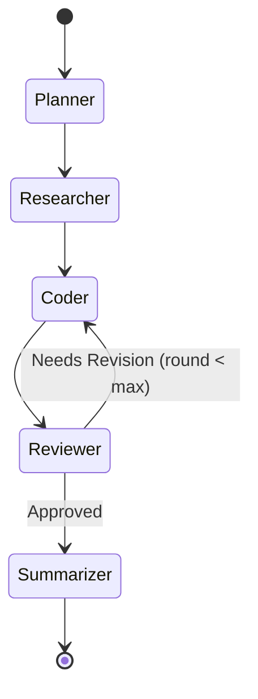
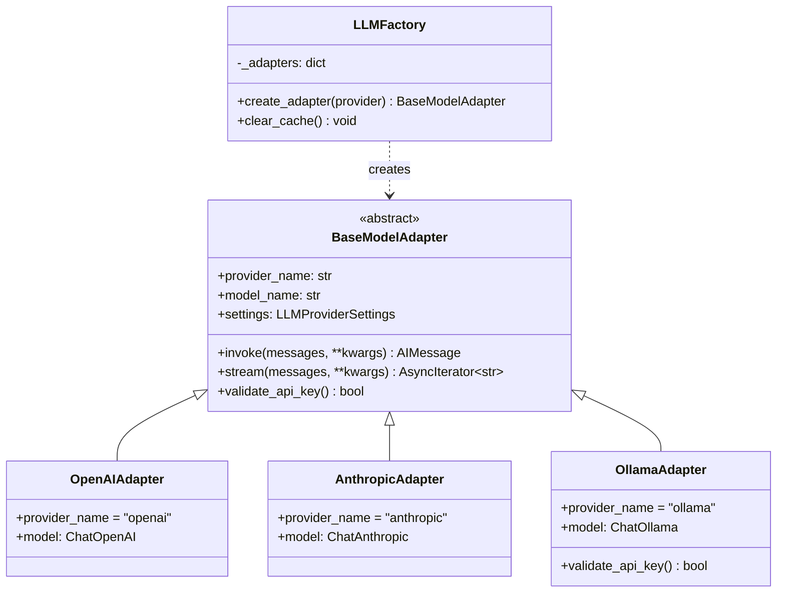
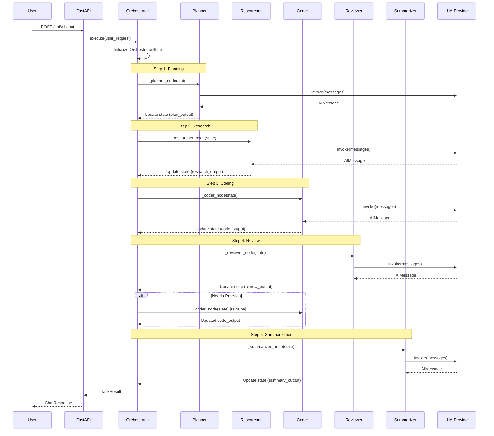
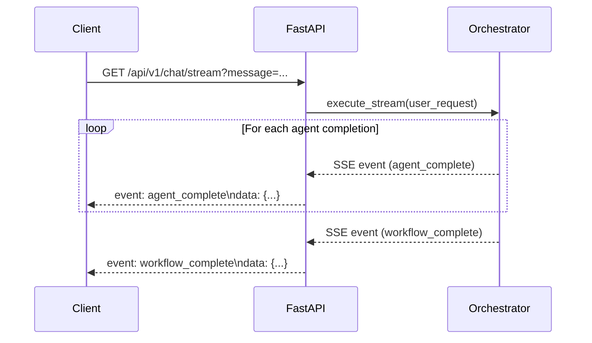
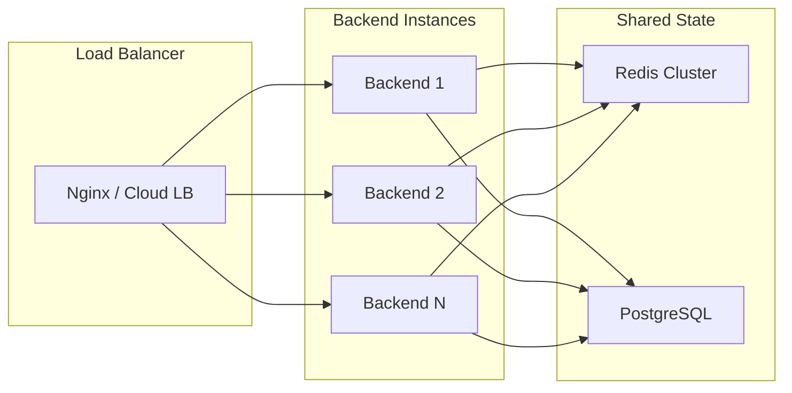
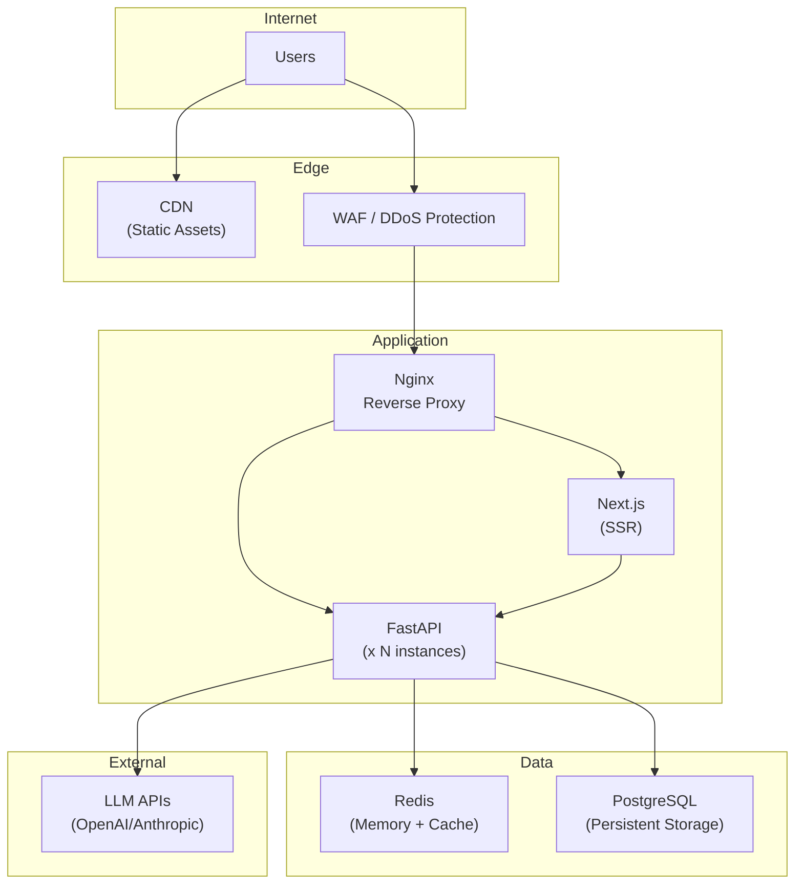

# Architecture Overview

This document provides a comprehensive overview of the AgentOrchestra system architecture, including design principles, component relationships, data flow, and technology choices.

---

## Table of Contents

- [Design Philosophy](#design-philosophy)
- [High-Level Architecture](#high-level-architecture)
- [Core Modules](#core-modules)
- [Data Flow](#data-flow)
- [Technology Choices](#technology-choices)
- [Scalability & Extensibility](#scalability--extensibility)
- [Deployment Architecture](#deployment-architecture)

---

## Design Philosophy

AgentOrchestra is built on the following core principles:

### 1. Separation of Concerns

Each component has a single, well-defined responsibility. The system is organized into distinct layers -- API, orchestration, agents, and services -- with clear boundaries and interfaces between them.

### 2. Adapter Pattern for LLM Providers

Rather than coupling to a specific LLM provider, AgentOrchestra uses an adapter pattern that provides a unified interface over OpenAI, Anthropic, and Ollama. This makes it trivial to add new providers or swap models without changing agent logic.

### 3. Stateful Workflow Orchestration

Using LangGraph's `StateGraph`, the orchestration engine manages a shared state object that flows through all agents. This enables agents to read outputs from previous agents and make decisions based on accumulated context.

### 4. Convention Over Configuration

Sensible defaults are provided for all configuration options, allowing developers to get started quickly while retaining the flexibility to customize behavior when needed.

### 5. Developer Experience First

Type safety, auto-generated documentation, comprehensive logging, and developer tooling are first-class concerns, not afterthoughts.

---

## High-Level Architecture



---

## Core Modules

### 1. API Layer (`app/api/`)

The API layer exposes RESTful endpoints for client interaction. It is built with FastAPI and follows API versioning best practices.

**Components:**

| Module | Path | Responsibility |
|--------|------|---------------|
| Chat Router | `api/v1/endpoints/chat.py` | Chat message processing, SSE streaming, conversation history |
| Agent Router | `api/v1/endpoints/agents.py` | Agent listing, detail retrieval, runtime configuration |
| Task Router | `api/v1/endpoints/tasks.py` | Task creation, listing, and status tracking |

**Key Features:**
- Automatic request validation via Pydantic models
- Structured error responses with consistent format
- CORS middleware for cross-origin support
- Request timing middleware for performance monitoring
- SSE (Server-Sent Events) for real-time streaming

### 2. Orchestration Core (`app/core/`)

The orchestration core is the heart of AgentOrchestra. It uses LangGraph's `StateGraph` to define and execute the multi-agent workflow.

**Key Class: `Orchestrator`**

```python
class Orchestrator:
    """Coordinates agent execution through a LangGraph workflow."""

    # Workflow: planner -> researcher -> coder -> reviewer -> (coder | summarizer) -> summarizer
    # The reviewer can route back to the coder for revisions (up to max_revision_rounds)
```

**Workflow Graph:**



**State Management:**

The `OrchestratorState` TypedDict carries all shared data through the workflow:

| Field | Type | Description |
|-------|------|-------------|
| `user_request` | `str` | Original user input |
| `plan_output` | `str` | Planner agent's output |
| `research_output` | `str` | Researcher agent's output |
| `code_output` | `str` | Coder agent's output |
| `review_output` | `str` | Reviewer agent's output |
| `summary_output` | `str` | Summarizer agent's output |
| `review_feedback` | `str` | Reviewer's feedback for revision |
| `revision_count` | `int` | Current revision iteration |
| `max_revisions` | `int` | Maximum allowed revisions |
| `agent_responses` | `list[dict]` | All agent responses for tracking |
| `error` | `str \| None` | Error message if workflow failed |
| `current_agent` | `str` | Name of currently executing agent |

### 3. Agent Layer (`app/agents/`)

Each agent extends the `BaseAgent` abstract class and implements a specific role in the workflow.

**Base Agent Interface:**

```python
class BaseAgent(abc.ABC):
    @property
    @abc.abstractmethod
    def name(self) -> str: ...

    @property
    @abc.abstractmethod
    def description(self) -> str: ...

    @property
    @abc.abstractmethod
    def role(self) -> str: ...

    @property
    @abc.abstractmethod
    def agent_type(self) -> AgentType: ...

    @property
    @abc.abstractmethod
    def system_prompt(self) -> str: ...

    @abc.abstractmethod
    async def execute(self, task: str, context: dict[str, Any]) -> AgentResponse: ...
```

**Built-in Agents:**

| Agent | Type | Role |
|-------|------|------|
| PlannerAgent | `PLANNER` | Analyzes the task and creates an execution plan |
| ResearcherAgent | `RESEARCHER` | Gathers relevant information and context |
| CoderAgent | `CODER` | Generates code and technical solutions |
| ReviewerAgent | `REVIEWER` | Reviews code quality and suggests improvements |
| SummarizerAgent | `SUMMARIZER` | Compiles a comprehensive final summary |

### 4. LLM Provider Layer (`app/models/`, `app/services/llm/`)

The LLM provider layer abstracts multiple AI model providers behind a unified interface using the Adapter pattern.

**Architecture:**



### 5. Service Layer (`app/services/`)

Business logic services that support agent operations:

| Service | Path | Description |
|---------|------|-------------|
| LLM Provider | `services/llm/provider.py` | Unified LLM interaction service |
| Conversation Memory | `services/memory/conversation.py` | Redis-backed conversation history |
| Search Tool | `services/tools/search.py` | Web search capabilities for agents |
| Code Executor | `services/tools/code_executor.py` | Sandboxed code execution |

### 6. Configuration (`app/config/`)

Centralized configuration management using `pydantic-settings`:

- Loads from environment variables and `.env` files
- Type-safe with validation
- Singleton pattern via `@lru_cache`
- Provider-specific settings groups

---

## Data Flow

### Request Lifecycle



### Streaming Flow

For real-time updates, the system uses Server-Sent Events (SSE):



---

## Technology Choices

### Why FastAPI?

- **Async-first** -- Native support for `async/await`, critical for I/O-bound LLM API calls
- **Automatic validation** -- Pydantic integration provides request/response validation out of the box
- **Auto-generated docs** -- Swagger UI and ReDoc are generated automatically from type hints
- **High performance** -- One of the fastest Python web frameworks (comparable to Go and Node.js)
- **Type safety** -- Full Python type hint support with editor autocompletion

### Why LangGraph?

- **Stateful workflows** -- Native support for maintaining state across agent interactions
- **Conditional routing** -- Built-in support for branching logic (e.g., review revision loop)
- **Streaming** -- First-class support for streaming intermediate results
- **Visualization** -- Workflow graphs can be visualized and debugged
- **LangChain ecosystem** -- Seamless integration with LangChain's tools and model providers

### Why Next.js?

- **React Server Components** -- Improved performance with server-side rendering
- **App Router** -- Modern routing with layouts, loading states, and error boundaries
- **TypeScript** -- First-class TypeScript support for type safety
- **API Routes** -- Built-in API routes for backend-for-frontend patterns
- **Rich ecosystem** -- Large community with extensive component libraries

### Why Redis?

- **In-memory speed** -- Sub-millisecond latency for conversation memory access
- **Pub/Sub** -- Native support for real-time event broadcasting
- **Persistence** -- Optional disk persistence for conversation history
- **TTL** -- Automatic expiration for cache entries
- **Proven** -- Battle-tested in production at scale

---

## Scalability & Extensibility

### Horizontal Scaling



**Scaling Strategies:**

| Component | Strategy | Notes |
|-----------|----------|-------|
| Backend | Horizontal (multiple instances) | Stateless API; state in Redis |
| Frontend | CDN + Edge caching | Static assets served from CDN |
| Redis | Cluster mode | Sharding for high availability |
| LLM Calls | Rate limiting + queuing | Provider-specific rate limits |

### Adding Custom Agents

New agents can be added by extending `BaseAgent`:

```python
from app.agents.base import BaseAgent
from app.schemas.agent import AgentType, AgentResponse

class MyCustomAgent(BaseAgent):
    @property
    def name(self) -> str:
        return "my_custom_agent"

    @property
    def agent_type(self) -> AgentType:
        return AgentType.PLANNER  # or define a new type

    @property
    def description(self) -> str:
        return "A custom agent for specialized tasks"

    @property
    def role(self) -> str:
        return "Performs specialized analysis"

    @property
    def system_prompt(self) -> str:
        return "You are a specialized analysis agent..."

    async def execute(self, task: str, context: dict) -> AgentResponse:
        # Implement your agent logic here
        return AgentResponse(agent_name=self.name, content="Result...")
```

### Adding LLM Providers

New LLM providers can be added by implementing `BaseModelAdapter`:

```python
from app.models.llm_models import BaseModelAdapter, LLMProviderSettings

class MyProviderAdapter(BaseModelAdapter):
    def __init__(self, settings: LLMProviderSettings) -> None:
        super().__init__(settings)
        self.provider_name = "my_provider"

    @property
    def model(self) -> BaseChatModel:
        # Return your LangChain chat model
        ...

    async def invoke(self, messages, **kwargs) -> AIMessage:
        # Implement invocation
        ...

    async def stream(self, messages, **kwargs) -> AsyncIterator[str]:
        # Implement streaming
        ...
```

---

## Deployment Architecture

### Production Deployment



### Docker Compose Services

| Service | Image | Purpose |
|---------|-------|---------|
| `backend` | Custom (Python 3.11) | FastAPI application |
| `frontend` | Custom (Node 18) | Next.js application |
| `redis` | `redis:7-alpine` | In-memory data store |
| `nginx` | `nginx:1.25-alpine` | Reverse proxy |

All services include health checks, resource limits, and automatic restart policies.
